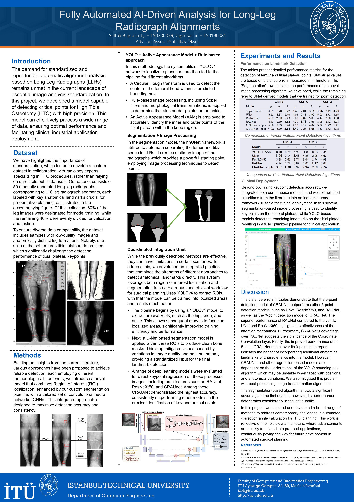

# Knee-Plateau-Point-Detection

# 1) Training Workflow

This project is designed to run a series of machine learning experiments automatically. It handles data synchronization, environment setup, training, evaluation, and visualization for multiple experimental configurations in a single run.

The workflow is managed by two primary scripts:

* `update_files.sh`: A shell script that prepares the project by copying source data (images, CSVs) into all the necessary working directories.
* `run_experiments3.py`: A Python script that iterates through a list of defined experiments, runs the full training/evaluation pipeline for each one, and saves all outputs (models, metrics, visualizations) into unique folders.

## Visualized Workflow

The process flows as follows:

1.  **Setup**: A user places raw data (images, CSVs, configs) into a single `source_data` directory.
2.  **Sync**: The `update_files.sh` script is run once to "deploy" this data to all the project's sub-folders (`/code/data`, `/data`, etc.).
3.  **Run**: The `run_experiments3.py` script is executed. It reads the base configs, generates new ones for each experiment, and then runs the training, evaluation, and visualization scripts.
4.  **Results**: All outputs, including the trained `.pth` models, are saved in the `experiment_results` directory, with a separate sub-folder for each experiment.

## 🚀 How to Run the Full Workflow

Follow these steps to set up the data and run all experiments.

### Step 1: Place Your Source Data

Place all your experiment's source files into the `source_data/experiment_5/` directory (or update the `SOURCE_DIR` variable in `update_files.sh` to point to your chosen folder).

This folder must contain:

* `images/` (A folder containing all your image files)
* `transformation_details.csv` (The landmarks CSV file)
* `example_config.json` (Your base training configuration template)
* `example_eval_config.json` (Your base evaluation configuration template)

### Step 2: Synchronize Data

Run the `update_files.sh` script from the project's root directory. This will delete old data and copy your new source files into all the locations where the Python scripts expect to find them.

```bash
bash update_files.sh
```

### Step 3: Training a Model

Consider your hyper-paramters hard-coded into the `run_experiments3.py` file.
Then run the script `run_experiments3.py` for doing multiple training experiments.

# 2) Testing Workflow

Similar to example_config.js file which represents the training configuration, example_eval_config.js file represents the evaluation configurations. 

I. Make sure to put the model file *.pth to the / directory.
II. Make sure that the example_eval_config.json file is properly arranged. For example "best_model_path" parameter must be match with the trained model name
III. Run the command: python main.py --config configs/example_eval_config.json

# 3) Presentation of Outputs




TODO:
1. Add a dataset that is not preprocessed
2. Add a dataset that is preprocessed

~~*3. Give visual outputs*~~
